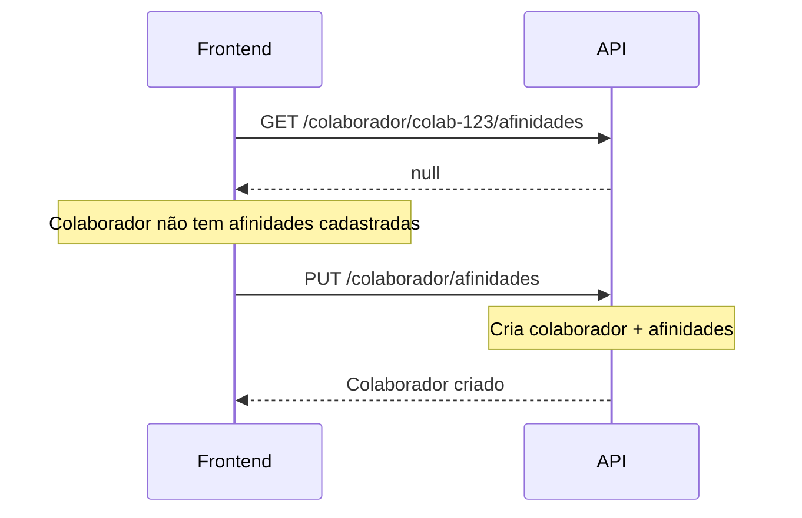
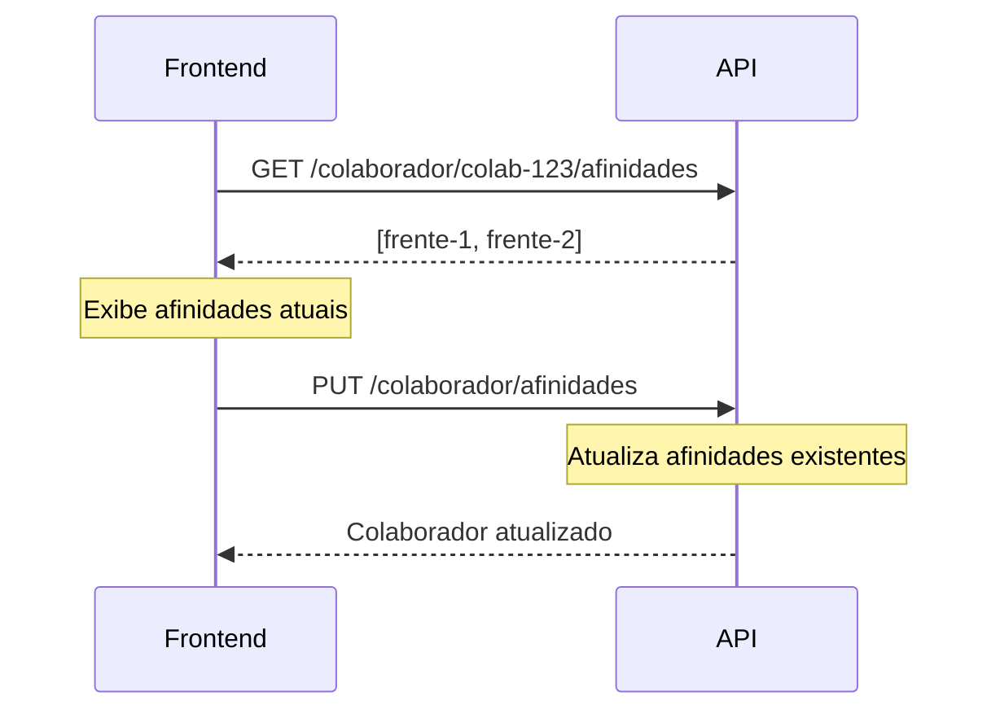

# Módulo Colaborador - Gestão de Afinidades

Sistema de afinidades de colaboradores com frentes/matérias usando padrão **UPSERT** e **Lazy Creation**.

---

## 🎯 Conceito

O colaborador existe em outra aplicação/domínio. Aqui gerenciamos apenas suas **afinidades** com frentes/matérias de forma desnormalizada (sem joins).

**Comportamento:**
- ✅ Se não existir → retorna `null` ao buscar
- ✅ Ao salvar → cria automaticamente se não existir (UPSERT)
- ✅ Dados desnormalizados → sem necessidade de joins

---

## 📦 Estrutura do Documento

```json
{
  "_id": "mongo-generated-id",
  "colaboradorId": "colab-123",
  "nome": "João Silva",
  "email": "joao@email.com",
  "userId": "user-456",
  "afinidades": [
    {
      "frenteId": "507f1f77bcf86cd799439012",
      "frenteNome": "Álgebra",
      "materiaId": "507f1f77bcf86cd799439013",
      "materiaNome": "Matemática",
      "adicionadoEm": "2025-11-24T10:00:00.000Z"
    },
    {
      "frenteId": "507f1f77bcf86cd799439014",
      "frenteNome": "Mecânica",
      "materiaId": "507f1f77bcf86cd799439015",
      "materiaNome": "Física",
      "adicionadoEm": "2025-11-24T11:00:00.000Z"
    }
  ],
  "createdAt": "2025-11-24T09:00:00.000Z",
  "updatedAt": "2025-11-24T11:00:00.000Z"
}
```

---

## 🌐 Endpoints

### 1. Buscar Afinidades de um Colaborador

```http
GET /v1/colaborador/:colaboradorId/afinidades
```

**Parâmetros:**
- `colaboradorId` - ID do colaborador (da outra aplicação)

**Resposta quando EXISTE (200):**
```json
[
  {
    "frenteId": "507f1f77bcf86cd799439012",
    "frenteNome": "Álgebra",
    "materiaId": "507f1f77bcf86cd799439013",
    "materiaNome": "Matemática",
    "adicionadoEm": "2025-11-24T10:00:00.000Z"
  },
  {
    "frenteId": "507f1f77bcf86cd799439014",
    "frenteNome": "Mecânica",
    "materiaId": "507f1f77bcf86cd799439015",
    "materiaNome": "Física",
    "adicionadoEm": "2025-11-24T11:00:00.000Z"
  }
]
```

**Resposta quando NÃO EXISTE (200):**
```json
null
```

**Exemplo cURL:**
```bash
curl http://localhost:3000/v1/colaborador/colab-123/afinidades
```

---

### 2. Salvar/Atualizar Afinidades (UPSERT)

```http
PUT /v1/colaborador/afinidades
Content-Type: application/json
```

**Body:**
```json
{
  "colaboradorId": "colab-123",
  "nome": "João Silva",
  "email": "joao@email.com",
  "userId": "user-456",
  "frentesIds": [
    "507f1f77bcf86cd799439012",
    "507f1f77bcf86cd799439014",
    "507f1f77bcf86cd799439016"
  ]
}
```

**Campos:**
| Campo | Tipo | Obrigatório | Descrição |
|-------|------|-------------|-----------|
| colaboradorId | string | Sim | ID do colaborador na outra aplicação |
| nome | string | Sim | Nome do colaborador |
| email | string | Sim | Email do colaborador |
| userId | string | Sim | ID do usuário |
| frentesIds | string[] | Sim | Array com IDs das frentes |

**Comportamento:**
- Se colaborador **NÃO existe** → Cria novo com as afinidades
- Se colaborador **JÁ existe** → Substitui afinidades pelas novas

**Resposta de Sucesso (200):**
```json
{
  "_id": "mongo-generated-id",
  "colaboradorId": "colab-123",
  "nome": "João Silva",
  "email": "joao@email.com",
  "userId": "user-456",
  "afinidades": [
    {
      "frenteId": "507f1f77bcf86cd799439012",
      "frenteNome": "Álgebra",
      "materiaId": "507f1f77bcf86cd799439013",
      "materiaNome": "Matemática",
      "adicionadoEm": "2025-11-24T12:00:00.000Z"
    },
    {
      "frenteId": "507f1f77bcf86cd799439014",
      "frenteNome": "Mecânica",
      "materiaId": "507f1f77bcf86cd799439015",
      "materiaNome": "Física",
      "adicionadoEm": "2025-11-24T12:00:00.000Z"
    }
  ],
  "createdAt": "2025-11-24T12:00:00.000Z",
  "updatedAt": "2025-11-24T12:00:00.000Z"
}
```

**Resposta de Erro (404):**
```json
{
  "statusCode": 404,
  "message": "Frente 507f1f77bcf86cd799439012 não encontrada",
  "error": "Not Found"
}
```

**Exemplo cURL:**
```bash
curl -X PUT http://localhost:3000/v1/colaborador/afinidades \
  -H "Content-Type: application/json" \
  -d '{
    "colaboradorId": "colab-123",
    "nome": "João Silva",
    "email": "joao@email.com",
    "userId": "user-456",
    "frentesIds": ["507f1f77bcf86cd799439012", "507f1f77bcf86cd799439014"]
  }'
```

---

### 3. Remover Afinidade Específica

```http
DELETE /v1/colaborador/:colaboradorId/afinidades/:frenteId
```

**Parâmetros:**
- `colaboradorId` - ID do colaborador
- `frenteId` - ID da frente a ser removida

**Resposta de Sucesso (200):**
```json
{
  "_id": "mongo-generated-id",
  "colaboradorId": "colab-123",
  "nome": "João Silva",
  "email": "joao@email.com",
  "userId": "user-456",
  "afinidades": [
    {
      "frenteId": "507f1f77bcf86cd799439014",
      "frenteNome": "Mecânica",
      "materiaId": "507f1f77bcf86cd799439015",
      "materiaNome": "Física",
      "adicionadoEm": "2025-11-24T11:00:00.000Z"
    }
  ],
  "createdAt": "2025-11-24T09:00:00.000Z",
  "updatedAt": "2025-11-24T12:30:00.000Z"
}
```

**Resposta quando colaborador não existe (200):**
```json
null
```

**Exemplo cURL:**
```bash
curl -X DELETE http://localhost:3000/v1/colaborador/colab-123/afinidades/507f1f77bcf86cd799439012
```

---

### 4. Buscar Colaboradores por Frente

```http
GET /v1/colaborador/frente/:frenteId
```

**Parâmetros:**
- `frenteId` - ID da frente

**Descrição:**
Retorna todos os colaboradores que têm afinidade com a frente especificada.

**Resposta de Sucesso (200):**
```json
[
  {
    "_id": "mongo-generated-id-1",
    "colaboradorId": "colab-123",
    "nome": "João Silva",
    "email": "joao@email.com",
    "userId": "user-456",
    "afinidades": [
      {
        "frenteId": "507f1f77bcf86cd799439012",
        "frenteNome": "Álgebra",
        "materiaId": "507f1f77bcf86cd799439013",
        "materiaNome": "Matemática",
        "adicionadoEm": "2025-11-24T10:00:00.000Z"
      }
    ]
  },
  {
    "_id": "mongo-generated-id-2",
    "colaboradorId": "colab-456",
    "nome": "Maria Santos",
    "email": "maria@email.com",
    "userId": "user-789",
    "afinidades": [
      {
        "frenteId": "507f1f77bcf86cd799439012",
        "frenteNome": "Álgebra",
        "materiaId": "507f1f77bcf86cd799439013",
        "materiaNome": "Matemática",
        "adicionadoEm": "2025-11-24T10:30:00.000Z"
      }
    ]
  }
]
```

**Exemplo cURL:**
```bash
curl http://localhost:3000/v1/colaborador/frente/507f1f77bcf86cd799439012
```

---

### 5. Buscar Colaboradores por Matéria

```http
GET /v1/colaborador/materia/:materiaId
```

**Parâmetros:**
- `materiaId` - ID da matéria

**Descrição:**
Retorna todos os colaboradores que têm afinidade com qualquer frente da matéria especificada.

**Resposta de Sucesso (200):**
```json
[
  {
    "_id": "mongo-generated-id",
    "colaboradorId": "colab-123",
    "nome": "João Silva",
    "email": "joao@email.com",
    "userId": "user-456",
    "afinidades": [
      {
        "frenteId": "507f1f77bcf86cd799439012",
        "frenteNome": "Álgebra",
        "materiaId": "507f1f77bcf86cd799439013",
        "materiaNome": "Matemática",
        "adicionadoEm": "2025-11-24T10:00:00.000Z"
      },
      {
        "frenteId": "507f1f77bcf86cd799439017",
        "frenteNome": "Geometria",
        "materiaId": "507f1f77bcf86cd799439013",
        "materiaNome": "Matemática",
        "adicionadoEm": "2025-11-24T10:30:00.000Z"
      }
    ]
  }
]
```

**Exemplo cURL:**
```bash
curl http://localhost:3000/v1/colaborador/materia/507f1f77bcf86cd799439013
```

---

## 📋 Fluxos de Uso

### **Fluxo 1: Primeiro Acesso (Colaborador Novo)**



**Código:**
```javascript
// 1. Verifica se tem afinidades
const afinidades = await fetch('/v1/colaborador/colab-123/afinidades');
// Retorna: null

// 2. Primeira vez - salva afinidades
await fetch('/v1/colaborador/afinidades', {
  method: 'PUT',
  body: JSON.stringify({
    colaboradorId: 'colab-123',
    nome: 'João Silva',
    email: 'joao@email.com',
    userId: 'user-456',
    frentesIds: ['frente-1', 'frente-2']
  })
});
```

---

### **Fluxo 2: Atualização de Afinidades (Colaborador Existente)**



**Código:**
```javascript
// 1. Busca afinidades atuais
const afinidadesAtuais = await fetch('/v1/colaborador/colab-123/afinidades');
// Retorna: [{frenteId: 'frente-1', ...}, {frenteId: 'frente-2', ...}]

// 2. Atualiza com novas afinidades
await fetch('/v1/colaborador/afinidades', {
  method: 'PUT',
  body: JSON.stringify({
    colaboradorId: 'colab-123',
    nome: 'João Silva',
    email: 'joao@email.com',
    userId: 'user-456',
    frentesIds: ['frente-1', 'frente-3', 'frente-4'] // Novas afinidades
  })
});
// Resultado: Substitui antigas por novas
```

---

### **Fluxo 3: Remover Afinidade Específica**

```javascript
// Remove apenas uma afinidade
await fetch('/v1/colaborador/colab-123/afinidades/frente-1', {
  method: 'DELETE'
});
// Resultado: Remove frente-1, mantém as outras
```

---

## 🔍 Casos de Uso

### **Caso 1: Tela de Configuração de Afinidades**

```javascript
// Componente: ConfiguracaoAfinidades.tsx

async function carregarAfinidades() {
  const response = await fetch(`/v1/colaborador/${colaboradorId}/afinidades`);
  const afinidades = await response.json();
  
  if (afinidades === null) {
    // Primeira vez - mostrar todas frentes disponíveis
    setModoSelecao('inicial');
  } else {
    // Já tem afinidades - mostrar selecionadas
    setAfinidadesSelecionadas(afinidades);
    setModoSelecao('edicao');
  }
}

async function salvarAfinidades(frentesSelecionadas) {
  await fetch('/v1/colaborador/afinidades', {
    method: 'PUT',
    headers: { 'Content-Type': 'application/json' },
    body: JSON.stringify({
      colaboradorId: colaboradorData.id,
      nome: colaboradorData.nome,
      email: colaboradorData.email,
      userId: colaboradorData.userId,
      frentesIds: frentesSelecionadas.map(f => f.id)
    })
  });
  
  toast.success('Afinidades salvas com sucesso!');
}
```

---

### **Caso 2: Listagem de Conteúdos Filtrados por Afinidade**

```javascript
// Componente: ConteudosRecomendados.tsx

async function carregarConteudosRecomendados() {
  // 1. Busca afinidades do colaborador
  const afinidades = await fetch(
    `/v1/colaborador/${colaboradorId}/afinidades`
  ).then(r => r.json());
  
  if (!afinidades) {
    return []; // Sem afinidades = sem recomendações
  }
  
  // 2. Busca conteúdos das frentes com afinidade
  const conteudos = [];
  for (const afinidade of afinidades) {
    const response = await fetch(
      `/v1/content?frente=${afinidade.frenteId}`
    );
    conteudos.push(...await response.json());
  }
  
  return conteudos;
}
```

---

### **Caso 3: Dashboard de Gestores - Quem tem afinidade com X**

```javascript
// Componente: GestaoColaboradores.tsx

async function buscarColaboradoresPorFrente(frenteId) {
  const response = await fetch(`/v1/colaborador/frente/${frenteId}`);
  const colaboradores = await response.json();
  
  // Exemplo de uso:
  // Mostrar quais colaboradores podem revisar conteúdo de Álgebra
  return colaboradores.map(c => ({
    nome: c.nome,
    email: c.email,
    totalAfinidades: c.afinidades.length
  }));
}
```

---

## ⚡ Performance

### **Índices Criados:**
```javascript
// Busca rápida por colaboradorId
{ colaboradorId: 1 } [unique]

// Busca colaboradores por frente (embedded)
{ 'afinidades.frenteId': 1 }

// Busca colaboradores por matéria (embedded)
{ 'afinidades.materiaId': 1 }
```

### **Complexidade das Operações:**

| Operação | Complexidade | Observação |
|----------|--------------|------------|
| GET afinidades | O(1) | Busca por índice único |
| PUT afinidades | O(n) | n = número de frentes |
| DELETE afinidade | O(1) | Update in-place |
| Buscar por frente | O(log n) | Índice embedded |

---

## ✅ Vantagens desta Abordagem

1. **Lazy Creation** ✅
   - Colaborador só é criado quando necessário
   - Sem necessidade de pré-cadastro

2. **Dados Desnormalizados** ✅
   - Zero joins nas consultas
   - Performance otimizada

3. **UPSERT Pattern** ✅
   - Simplifica lógica do front-end
   - Sempre funciona (cria ou atualiza)

4. **Flexibilidade** ✅
   - Colaborador pode ter 0 a N afinidades
   - Fácil adicionar/remover

5. **Auditoria** ✅
   - Campo `adicionadoEm` para histórico
   - Timestamps automáticos

---

## 🔄 Sincronização de Dados

### **Problema:** E se mudar o nome da Frente/Matéria?

**Opções de Solução:**

### **1. Aceitar Inconsistência Temporária** (Recomendado)
- Dados desnormalizados podem ficar desatualizados
- Aceitável pois mudanças são raras
- Melhora muito a performance

### **2. Webhook/Event**
```typescript
// frente.service.ts
@OnEvent('frente.nome.atualizado')
async onFrenteNomeAtualizado(payload: { frenteId, novoNome }) {
  // Atualiza todos colaboradores
  await this.colaboradorRepository.model.updateMany(
    { 'afinidades.frenteId': payload.frenteId },
    { $set: { 'afinidades.$.frenteNome': payload.novoNome } }
  );
}
```

### **3. Batch Job Noturno**
```typescript
// Roda 1x por dia
async syncAllAfinidades() {
  const colaboradores = await this.repository.model.find();
  
  for (const colaborador of colaboradores) {
    for (const afinidade of colaborador.afinidades) {
      const frente = await this.frenteRepository.getById(afinidade.frenteId);
      afinidade.frenteNome = frente.nome;
      // ... atualiza materia também
    }
    await this.repository.update(colaborador);
  }
}
```

---

## 📊 Exemplo Completo de Integração

```typescript
// service-frontend.ts
class AfinidadesService {
  async carregarOuCriar(colaboradorData) {
    // Tenta buscar
    let afinidades = await this.getAfinidades(colaboradorData.id);
    
    if (afinidades === null) {
      // Primeira vez - cria com afinidades vazias
      await this.salvar(colaboradorData, []);
      afinidades = [];
    }
    
    return afinidades;
  }
  
  async getAfinidades(colaboradorId) {
    const response = await fetch(
      `/v1/colaborador/${colaboradorId}/afinidades`
    );
    return await response.json(); // null ou array
  }
  
  async salvar(colaboradorData, frentesIds) {
    const response = await fetch('/v1/colaborador/afinidades', {
      method: 'PUT',
      headers: { 'Content-Type': 'application/json' },
      body: JSON.stringify({
        colaboradorId: colaboradorData.id,
        nome: colaboradorData.nome,
        email: colaboradorData.email,
        userId: colaboradorData.userId,
        frentesIds
      })
    });
    
    return await response.json();
  }
  
  async remover(colaboradorId, frenteId) {
    await fetch(
      `/v1/colaborador/${colaboradorId}/afinidades/${frenteId}`,
      { method: 'DELETE' }
    );
  }
}
```

---

**Documentação gerada em:** 24 de Novembro de 2025  
**Versão:** 1.0.0  
**Padrão:** UPSERT + Lazy Creation + Desnormalização

